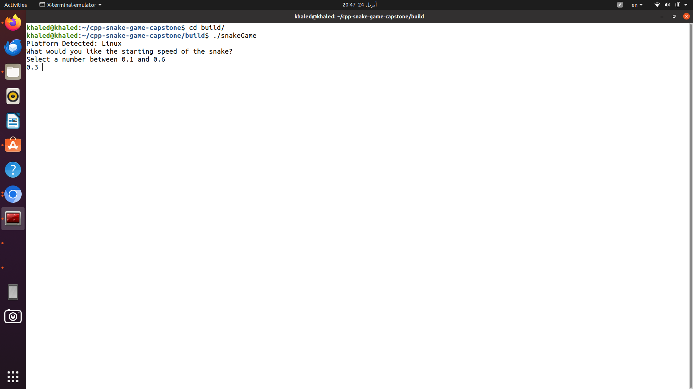
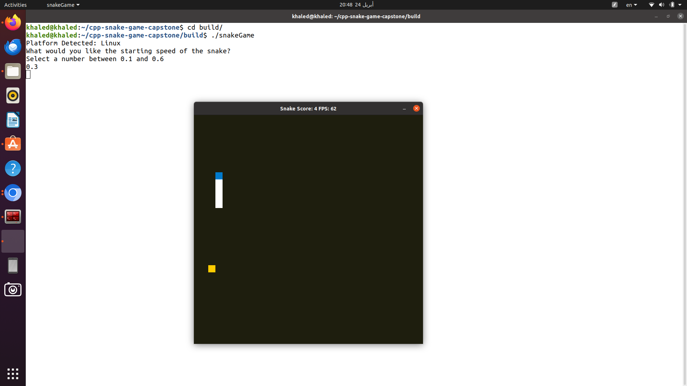

# Udacity C++ Nanodegree

## `Project: Capstone Snake Game Clone`

# Overview

This C++ project is the fifth and final project of the Udacity C++ Nanodegree.
The source code has been heavily adapted from the provided starter code located at (Udacity's repo)[https://github.com/udacity/CppND-Capstone-Snake-Game].
The code base can be divided architecturally and functionally into four distinct class-based components:

- Renderer component is responsible for rendering the state of the game using the popular [SDL library](https://www.libsdl.org/)

- Game component constructs and maintains the game board and placement of the game elements like the snake and food.

- Snake component constructs and maintains the snake object as it moves across the board gaining points and checking if it ran into itself.

- Controller component receives input from the user in order to control movement of the snake.

Once the game starts and creates the `Game`, `Controller`, and `Snake` objects, the game continues to loop through each component as it grabs input from the user, `Controller`, updates the state of the `Game`, and graphically renderers the state of the game, `Render`.

Upon lauching the game, the user is first greeted with the detected system platform.
The user is then asked for the starting speed of the `snake`

The game board launches after the user provides a valid speed and the user is able to play the game by moving the snake around with the arrow keys.

## Dependencies for Running Locally

- cmake >= 3.7
  - All OSes: [click here for installation instructions](https://cmake.org/install/)
- make >= 4.1 (Linux, Mac), 3.81 (Windows)
  - Linux: make is installed by default on most Linux distros
  - Mac: [install Xcode command line tools to get make](https://developer.apple.com/xcode/features/)
  - Windows: [Click here for installation instructions](http://gnuwin32.sourceforge.net/packages/make.htm)
- SDL2 >= 2.0
  - All installation instructions can be found [here](https://wiki.libsdl.org/Installation)
  - Note that for Linux, an `apt` or `apt-get` installation is preferred to building from source.
- gcc/g++ >= 5.4
  - Linux: gcc / g++ is installed by default on most Linux distros
  - Mac: same deal as make - [install Xcode command line tools](https://developer.apple.com/xcode/features/)
  - Windows: recommend using [MinGW](http://www.mingw.org/)

## Basic Build Instructions

1. Clone this repo.
2. Make a build directory in the top level directory: `mkdir build && cd build`
3. Compile: `cmake .. && make`
4. Run it: `./snakeGame`.

Revamped Rubric Items:

1. Object-Oriented Architecture Mastery:
   - Implementation of Object-Oriented Programming techniques is evident.
   - Codebase demonstrates a structured organization with classes containing pertinent data and methods.

   Implementation Details:
   A dedicated MetaGame class, residing in `metagame.h`, orchestrates system platform information handling. Leveraging member functions like getPlatform and printPlatform, it adeptly retrieves and presents the user's detected system platform.

2. Class Member Access Specifiers Proficiency:
   - Adequate usage of access specifiers for class members ensures encapsulation.
   - Class data members are explicitly designated as public, protected, or private.

   Execution Summary:
   Within `metagame.h`, the private variable platformUsed (located at line 19) securely stores the detected system without external modification access.

3. Constructor Efficiency via Member Initialization:
   - Effective utilization of member initialization lists in class constructors.
   - Initialization of class members with argument values via initialization lists.

   Technical Approach:
   Inside `metagame.h` (at line 11), the default argument for the private variable platformUsed is a null string, efficiently set within the class's initialization list.

4. Implementation Abstraction and Documentation:
   - Class member functions abstract implementation complexities from interfaces.
   - Comprehensive documentation of member functions' effects ensures clarity and maintainability.

   Documentation Strategy:
   The project adheres to Google's C++ Guide for documentation standards. For instance, in `metagame.h` (line 16), a concise comment elucidates the purpose of the getPlatform function. Additionally, function comments, such as in `snake.h` (line 25), further enhance code comprehensibility.

5. User Interaction and Input Processing:
   - Project adeptly handles user input and incorporates it into program functionality.
   - Flexibility provided for user interaction, ensuring seamless program operation.

6. Smart Pointers

  - In this update, the code was refactored to use smart pointers instead of raw pointers. Smart pointers, such as `std::unique_ptr` and `std::shared_ptr`, provide automatic memory management, reducing the likelihood of memory leaks and simplifying resource management.

  - The following changes were made to incorporate smart pointers:
    - Replaced raw pointers with `std::unique_ptr` or `std::shared_ptr` where appropriate.
    - Utilized `std::make_unique` or `std::make_shared` to create smart pointers in a safe and efficient manner.

7. Threading

  - Threading functionality was introduced to enhance performance and responsiveness by running the game loop asynchronously in a separate thread. This allows for concurrent execution of game logic and user input handling.

  - The following changes were made to incorporate threading:
    - Created a separate thread to run the game loop asynchronously.
    - Used synchronization primitives such as `std::mutex` and `std::condition_variable` to coordinate the execution of threads and ensure thread safety.
    - Implemented proper resource management and cleanup, including the use of destructors, to avoid resource leaks and ensure program stability.